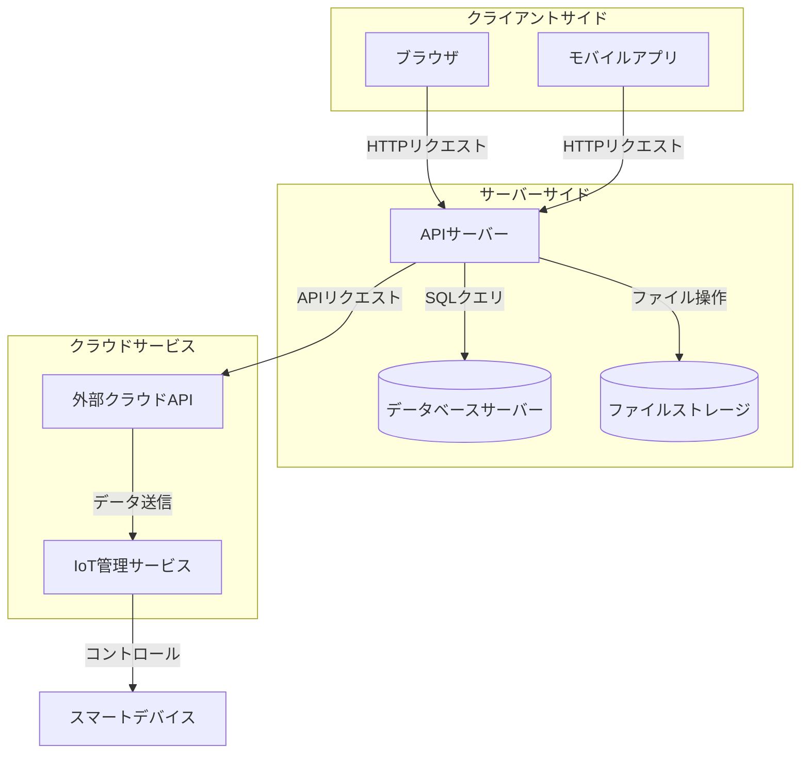
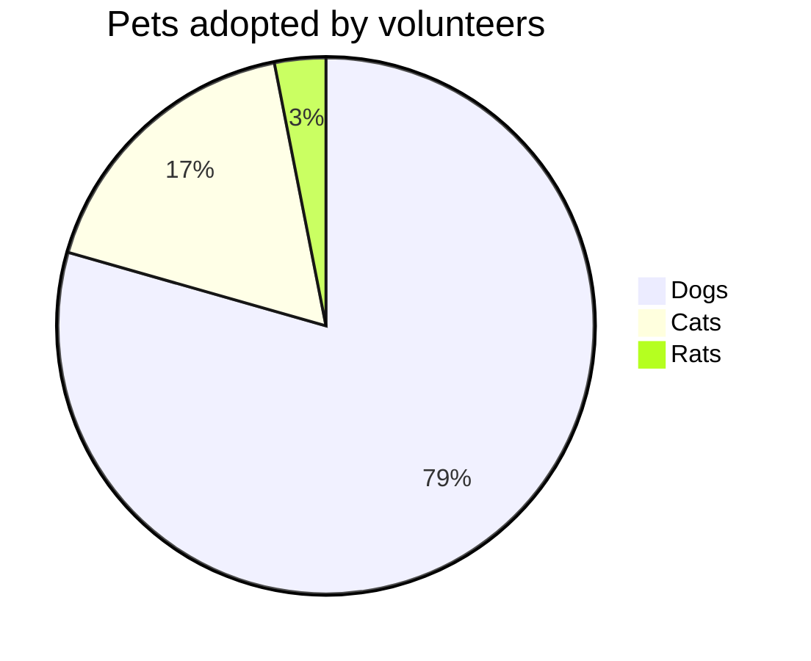

```mermaid
graph TD;
    subgraph ClientSide [クライアントサイド]
        Browser[ブラウザ]
        MobileApp[モバイルアプリ]
    end

    subgraph ServerSide [サーバーサイド]
        API[APIサーバー]
        DB[(データベースサーバー)]
        FileStorage[(ファイルストレージ)]
    end

    subgraph CloudService [クラウドサービス]
        CloudAPI[外部クラウドAPI]
        IoTService[IoT管理サービス]
    end

    Browser -->|HTTPリクエスト| API
    MobileApp -->|HTTPリクエスト| API
    API -->|SQLクエリ| DB
    API -->|ファイル操作| FileStorage
    API -->|APIリクエスト| CloudAPI
    CloudAPI -->|データ送信| IoTService
    IoTService -->|コントロール| Device[スマートデバイス]
```

```mermaid
pie title Pets adopted by volunteers
    "Dogs" : 386
    "Cats" : 85
    "Rats" : 15

```