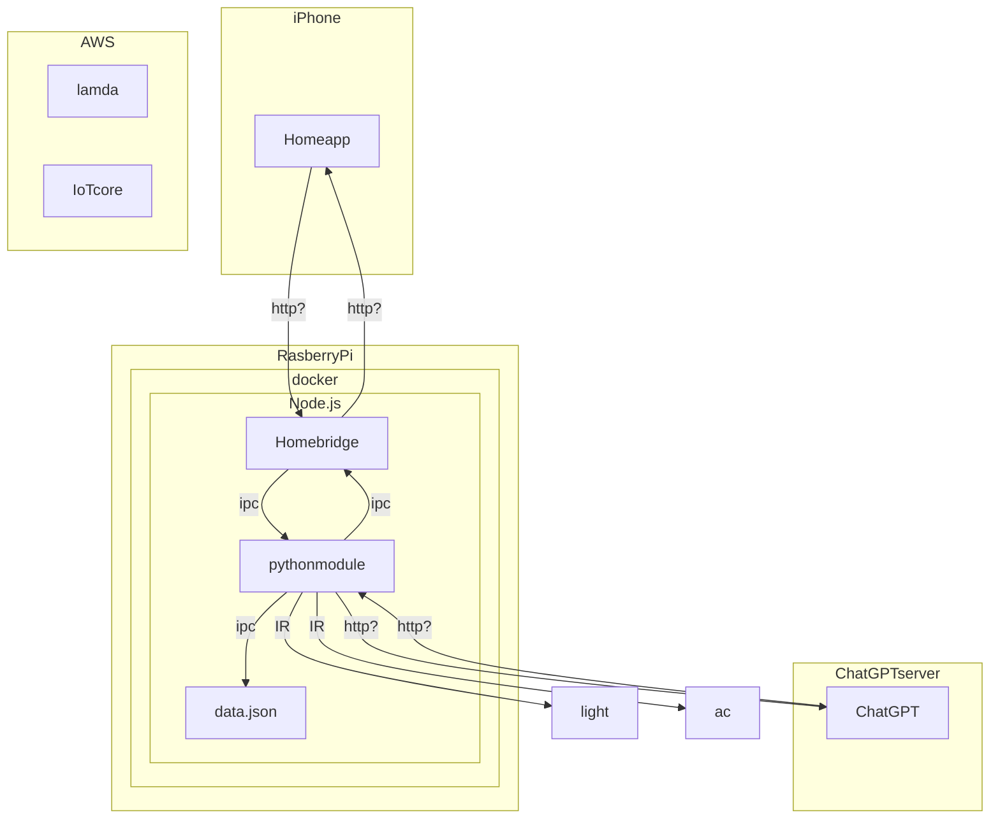

```mermaid
graph TD;
    subgraph iPhone [iPhone]
        Homeapp[Homeapp]
    end

    subgraph ChatGPTserver [ChatGPTserver]
        ChatGPT[ChatGPT]
    end

    subgraph AWS [AWS]
        lamda[lamda]
        IoTcore[IoTcore]
    end

    subgraph RasPiSide [RasberryPi]
        subgraph dockercontainer[docker]
            subgraph Node.js[Node.js]
                Homebridge[Homebridge]
                pythonmodule[pythonmodule]
                data.json[data.json]
            end
        end
    end

    light

    ac

    Homeapp -->|http?| Homebridge
    Homebridge -->|ipc| pythonmodule
    Homebridge -->|http?| Homeapp
    pythonmodule -->|IR| light
    pythonmodule -->|IR| ac
    pythonmodule -->|ipc| Homebridge
    pythonmodule -->|ipc| data.json
    pythonmodule -->|http?| ChatGPT
    ChatGPT -->|http?| pythonmodule
```

