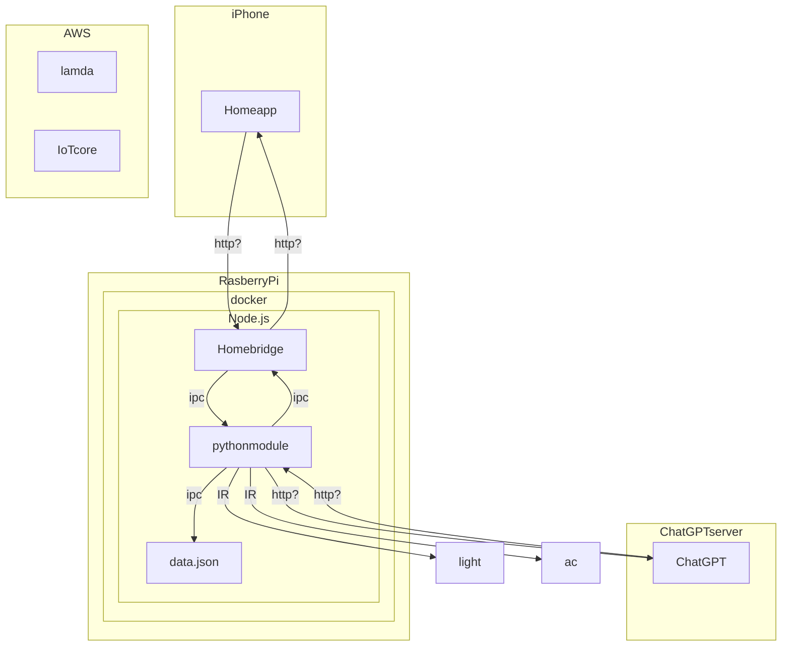

# System Architecture

## Overview
このドキュメントは、[プロジェクト名]のシステムアーキテクチャを説明します。このシステムは、Raspberry PiとAWSを連携させて[目的や機能]を実現します。

## Architecture Diagram

## Components

### 1. Raspberry Pi
- **役割**: センサーからデータを収集し、AWS IoT Coreに送信します。
- **使用技術**: [使用するプログラミング言語やライブラリ、OSなど]
- **動作**: 定期的にセンサーデータを測定し、MQTTプロトコルを介してデータをAWSに送信します。

### 2. AWS IoT Core
- **役割**: Raspberry Piから送信されたデータを受信し、処理します。
- **使用技術**: MQTT, HTTP
- **動作**: 受信したデータをAWS Lambda関数に転送します。

### 3. AWS Lambda
- **役割**: データを処理し、DynamoDBなどに保存します。
- **使用技術**: Node.js (または使用する言語)
- **動作**: IoT Coreからデータを受け取り、DynamoDBに保存します。

### 4. DynamoDB
- **役割**: センサーデータを保存するためのデータベースです。
- **使用技術**: NoSQLデータベース
- **動作**: Lambda関数によって受信したデータを保存します。

## Data Flow
1. Raspberry Piがセンサーからデータを収集します。
2. 収集したデータをAWS IoT Coreに送信します。
3. AWS IoT Coreがデータを受信し、Lambda関数に転送します。
4. Lambda関数がデータを処理し、DynamoDBに保存します。

## Security
- **認証**: AWS IoT Coreに接続する際は、X.509証明書を使用して認証します。
- **アクセス管理**: IAMポリシーを用いて、Lambda関数やDynamoDBへのアクセスを制限します。

## Conclusion
このアーキテクチャにより、リアルタイムでセンサーデータを収集・処理し、必要に応じてデータを保存・分析するシステムが実現されます。

