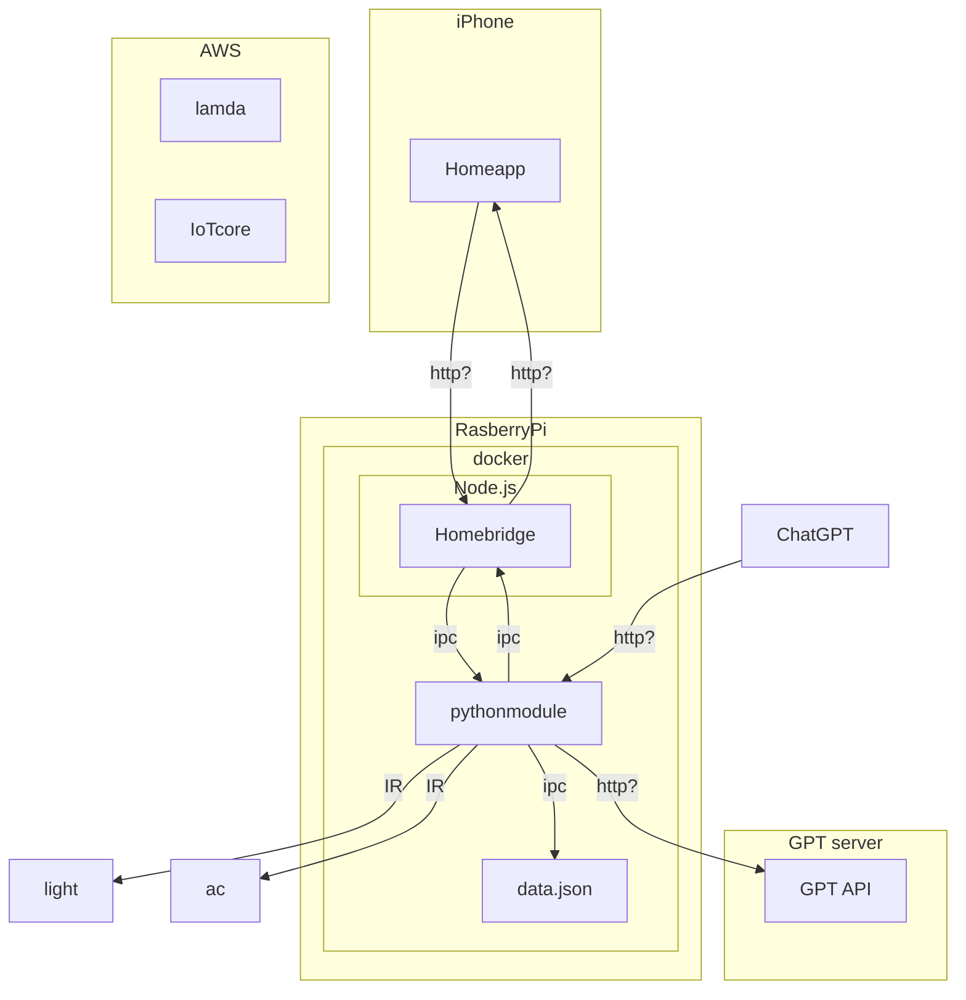

# System Architecture

## 配置図

```mermaid
graph TD;
    subgraph iPhone [iPhone]
        Homeapp[Homeapp]
    end

    subgraph GPTserver [GPT server]
        GPTAPI[GPT API]
    end

    subgraph AWS [AWS]
        lamda[lamda]
        IoTcore[IoTcore]
    end

    subgraph RasPiSide [RasberryPi]
        subgraph dockercontainer[docker]
            subgraph Node.js[Node.js]
                Homebridge[Homebridge]
            end
            pythonmodule[pythonmodule]
            data.json[data.json]
        end
    end

    light

    ac

    Homeapp -->|http?| Homebridge
    Homebridge -->|ipc| pythonmodule
    Homebridge -->|http?| Homeapp
    pythonmodule -->|IR| light
    pythonmodule -->|IR| ac
    pythonmodule -->|ipc| Homebridge
    pythonmodule -->|ipc| data.json
    pythonmodule -->|http?| GPTAPI
    ChatGPT -->|http?| pythonmodule
```

## クラス図
~~~mermaid
classDiagram
    class IRController{
        
    }

    class Device{
        <<abstruct>>
        +getstatus()
        -setstatuse()
    }

    class Bulb {
        <<interface>>
        +brightness()*
        +colortemp()*
    }

    class Re0207 {
        +brightness()
        +colortemp()
        -change_mode()
        -change_brightness()
        -change_colortemp()
    }

    class ClRs2 {
        +brightness()
        +colortemp()
        -change_mode()
        -change_brightness()
        -change_colortemp() 
    }

    class HeaterCooler {
        <<interface>>
        +mode()*
        +temp()*
    }

    class PanasonicAc {
        +getstate()
        +mode()
        +temp()      
    }

    class Cmd4Client {
        
    }

    class CliOperater {

    }

    class GptClient {

    }

    Bulb --|> Device
    HeaterCooler --|> Device

    Re0207 --|> Bulb
    ClRs2 --|> Bulb
    PanasonicAc --|> HeaterCooler
    

    Re0207 ..> IRController : calls
    ClRs2 ..> IRController : calls
    PanasonicAc ..> IRController : calls

    Cmd4Client ..> Re0207 : calls
    CliOperater ..> Re0207 : calls
    GptClient ..> Re0207 : calls
    Cmd4Client ..> ClRs2 : calls
    CliOperater ..> ClRs2 : calls
    GptClient ..> ClRs2 : calls
    Cmd4Client ..> PanasonicAc : calls
    CliOperater ..> PanasonicAc : calls
    GptClient ..> PanasonicAc : calls
~~~

## シーケンス図
ユーザストーリに紐づいて、動的な設計が特に必要な場合記述する
### [0.1 開発者が、CICDを使用して開発効率を、向上したい。](docs/requirements.md###0.1開発者が、CICDを使用して開発効率を、向上したい。)
~~~mermaid
~~~
